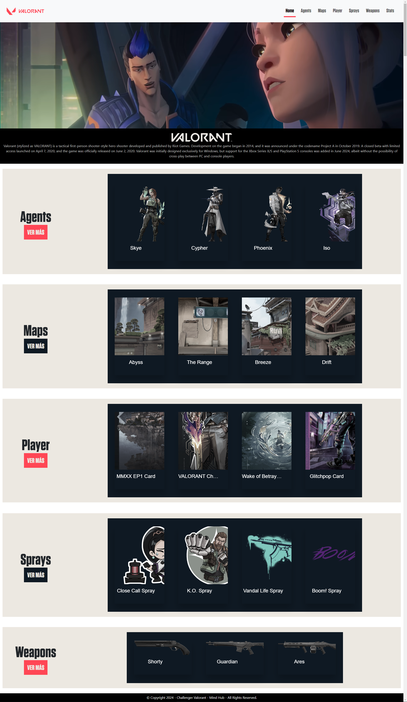

# Challenge of the MindHUb - "Valorant"

This is a solution to the [Mind Hub](https://mindhubweb.com/). In this repository you will find the page "Valorant" - 1st Challenge of the MindHUb course stage: FRONT-ENT, created with HTML, CSS, BOOTSTRAP, JAVASCRIPT and VUE.

## Table of contents

-   [Overview](#overview)
    -   [The challenge](#the-challenge)
    -   [Api](#api)
    -   [Screenshot](#screenshot)
    -   [Links](#links)
-   [Project](#project)
    -   [Built with](#built-with)
    -   [Requirements](#requirements)
    -   [Deliverable](#deliverable)
-   [Authors](#authors)

## Overview

### The challenge

Design a web page based on the assigned API information that contains at least the following parameters:

-   Home or main page where the introduction to the topic or the main content is shown, depending on the assigned information, decide and design whether to show all the data on the same page or divide it into several; the information on characters, chapters, maps, meals or whatever applies must be shown in cards and have their relevant filters (Minimum text filter and checkbox).

-   Details page, detailed information should be displayed for each card that the application has.

-   Statistics or information page, this page should show a table with important information about your topic.

-   The main page must have a FAVORITES modal, in this modal depending on the theme in which it is located, the favorite elements are displayed. This information must be persistent locally, even if the page is updated.

### Api

Api : https://valorant-api.com/

### Screenshot

### Links

-   Solution URL: [https://github.com/Allpez/ValorantVueProject](https://github.com/Allpez/ValorantVueProject)
-   Live Site URL 1: [https://allpez.github.io/ValorantVueProject/](https://allpez.github.io/ValorantVueProject/)
-   Live Site URL 2: [https://valorantvueapp.netlify.app/](https://valorantvueapp.netlify.app/)

## Project

### Built with

-   Semantic HTML5 markup
-   CSS custom properties
-   Flexbox
-   CSS Grid
-   Introduction to JavaScript
-   Functions
-   Conditionals
-   Arrays and objects
-   Loops
-   DOM
-   Higher-order functions and array methods
-   Events
-   URL search parameters
-   Asynchronicity (especially search)
-   ECMA 6 (especially import and export)
-   LocalStorage

### Requirements

-   All pages must have a navbar and footer
-   They must use Vue
-   They must work collaboratively using Git
-   Bootstrap must be used for the most part but they can use their own styles
-   Have the camera on at all times
-   The page must be Full Responsive

### Deliverable

-   A project containing all of the above and more is expected
-   Important documentation of your project, mockups and design, tools used.
-   Repository with progress and help from everyone in commits
-   Final presentation supporting your work
-   Deadline Wednesday, September 9th
-   Presentation to mentors on September 9th
-   Final presentation September 10th

### Useful Resources

-   Discord
-   Zoom
-   Plataforma Mindhub
-   GitHub, Git
-   HTML, CSS, Bootstrap, JavaScript
-   Visual Studio Code

## Authors

-   Alexander Lopez Osorio
-   Jesus Alberto Vera Pompa
-   Cristian Ruiz
-   Samir Macias
-   Jhonathan Serrano